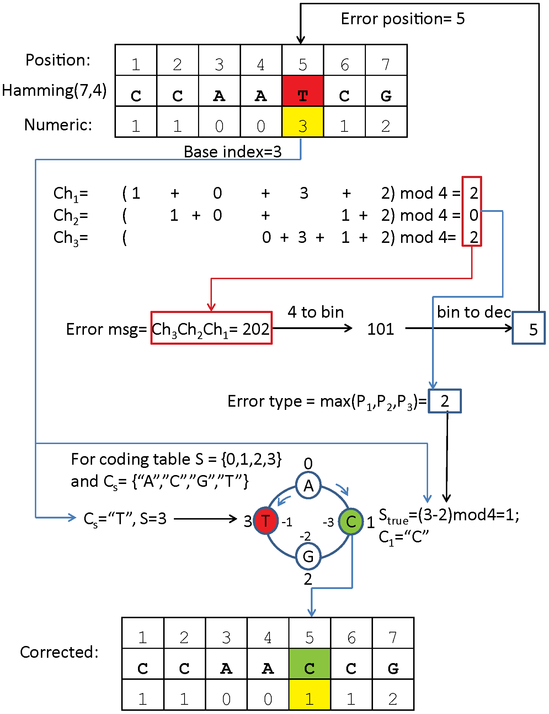

[](https://travis-ci.org/mdshw5/hamstring)
[](https://img.shields.io/pypi/v/pyfaidx.svg?branch=master)

This python module generates, checks, and corrects quaternary Hamming barcodes. The theory for generating quaternary (DNA) Hamming barcodes comes from the publication [Bystrykh, L. V. (2012). Generalized DNA Barcode Design Based on Hamming Codes. PLoS ONE](http://www.plosone.org/article/info:doi/10.1371/journal.pone.0036852). Currently, the `hamstring` module only works with Hamming7,4 encoding, but may be generalized to other sizes of data and parity bits.

[](http://journals.plos.org/plosone/article?id=10.1371/journal.pone.0036852#pone-0036852-g001)

## Usage

**Generate Hamming DNA barcodes**

    generateBarcodes.py [-h] out

    arguments:
      out         output barcode file name
      -h, --help  show this help message and exit
      -p PARITY, --parity PARITY
                        length of the parity bit e.g. 4 for Hamming8,4.
                        default=3

example output:

    index base4 nucleotide gc
    0 0000000 AAAAAAA 0.0
    1 3303001 TTATAAC 0.14
    2 2202002 GGAGAAG 0.57
    3 1101003 CCACAAT 0.43
    4 0303010 ATATACA 0.14

**Checksum a list of Hamming DNA barcodes**

    checkBarcodes.py [-h] list

    arguments:
      list        list of barcodes to check, one per line
      -h, --help  show this help message and exit
      -p PARITY, --parity PARITY
                        length of the parity bit e.g. 4 for Hamming8,4.
                        default=3

example output:

    in	fixed	checksum
    CATAACT	CAAAACT	A > T at pos 3
    AGAGAGA	AGAGAGA	ok
    TCACAGC	TCACAGC	ok
    GAACAGG	GAAAAGG	A > C at pos 4
    CTATAGT	CTATAGT	ok
    TTTAAAN	NNNNNNN	bad
    NNNNNNN	NNNNNNN	bad

**Tag fastq reads with a barcode (for generating a simulated dataset)**

    tagReads.py [-h] -e nb fastq out

    arguments:
      nb          number of barcodes to generate
      fastq       fastq file to process
      out         name for new fastq file
      -e, --erate error rate for single barcode base errors. default=0.05
      -p PARITY, --parity PARITY
                        length of the parity bit e.g. 4 for Hamming8,4.
                        default=3
      -h, --help  show this help message and exit

example input:

    @HWI-EAS179_0001:5:1:7:119#0/1
    CAGGGCGCGAATGNTTTGAGAGGGANATTGGAAANNNNNGATAGANNGGNCTATNNTGNNNNNNNNNNNNNNNNNN
    +
    HIHHHGHHHFDHH#EHHH?HHHDH>#DGGG@7@?##########################################

example output:

    @HWI-EAS179_0001:5:1:7:119#0/1
    CCATGGCCAGGGCGCGAATGNTTTGAGAGGGANATTGGAAANNNNNGATAGANNGGNCTATNNTGNNNNNNNNNNNNNNNNNN
    +
    HHHHHHHHIHHHGHHHFDHH#EHHH?HHHDH>#DGGG@7@?##########################################

**Check and fix barcodes in fastq file**

    fixFastq.py [-h] [-s] list fastq out

    arguments:
      list        list of barcodes used in experiment, one per line
      fastq       fastq file to process
      out         name for new fastq file
      -s, --strict  change all barcodes not in list to 'N'
      -h, --help  show this help message and exit

example input:

    @HWI-EAS179_0001:5:1:7:119#0/1
    GCATGGCCAGGGCGCGAATGNTTTGAGAGGGANATTGGAAANNNNNGATAGANNGGNCTATNNTGNNNNNNNNNNNNNNNNNN
    +
    HHHHHHHHIHHHGHHHFDHH#EHHH?HHHDH>#DGGG@7@?##########################################

example output:

    @HWI-EAS179_0001:5:1:7:119#0/1
    CCATGGCCAGGGCGCGAATGNTTTGAGAGGGANATTGGAAANNNNNGATAGANNGGNCTATNNTGNNNNNNNNNNNNNNNNNN
    +
    HHHHHHHHIHHHGHHHFDHH#EHHH?HHHDH>#DGGG@7@?##########################################

## Requirements

- Python 2.7 or Python 3.2+

## Hamstring Module

The core hamstring module has no external module dependencies and should run under any OS.

`base4Encode(n,d)` is used to convert decimal notation *n* to quaternary notation with *d* leading digits. *example*:

    hamstring.base4Encode(22, 4)
    [0, 1, 1, 2]

`generateHamming(data,parity)` is used to generate DNA quaternary Hamming codes from list of quaternary digits *data* with *parity* number of parity bits.
*example*:

```python
>>> generateHamming([0,1,1,2], 3)
Barcode(base4='1100112', nucleotide='CCAACCG', gc=0.71)

>>> generateHamming([0,1,1,2], 4)
Barcode(base4='11001122', nucleotide='CCAACCGG', gc=0.75)
```

`decodeHamming(barcode,parity)` is used to decode *barcode* nucleotide Hamming string with *parity* number of parity bits, and perform error correction if needed.
*example*:

```python
>>> decodeHamming('CCAACCG', 3)
CheckedBarcode(nucleotide='CCAACCG', chksum='ok')

>>> decodeHamming('CCAACCGG', 4)
CheckedBarcode(nucleotide='CCAACCGG', chksum='ok')

>>> decodeHamming('CCATCCG', 3)
CheckedBarcode(nucleotide='CCAACCG', chksum='A > T at pos 4')

>>> decodeHamming('CCATCCGG', 4)
CheckedBarcode(nucleotide='CCAACCGG', chksum='A > T at pos 4')

>>> decodeHamming('TCATCCGG', 4)
CheckedBarcode(nucleotide='NNNNNNNN', chksum='bad')
```

## Author

Matt Shirley - mdshw5'at'gmail'.'com - [http://mattshirley.com](http://mattshirley.com)
